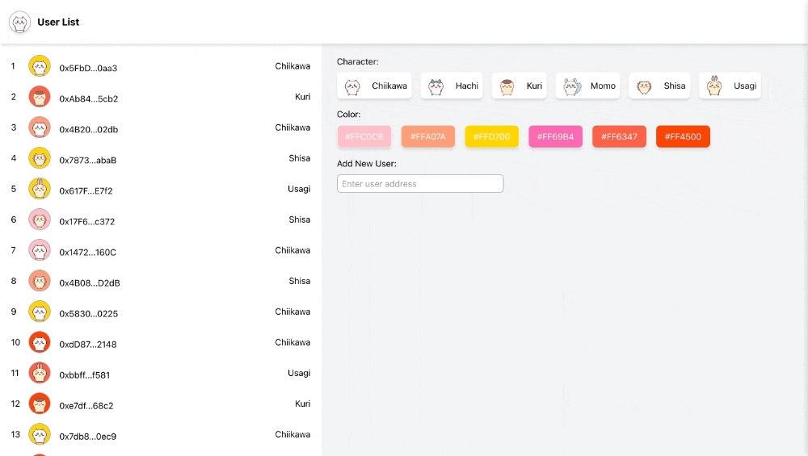

# Distribute Avatar to EVM Address



## Description

This project assigns a unique avatar to each EVM address, enabling a visually distinct representation for every user based on their address. Perfect for dApps that want to give users a unique visual identifier without needing a database.

**Demo**: [distribute-avatar.vercel.app](https://distribute-avatar.vercel.app/)

## Features

- **Unique Avatars**: Ensure each EVM address receives a unique avatar.
- **Address Validation**: Add and verify valid EVM addresses for users.
- **Character Filtering**: Filter users by specific characters in their addresses.
- **Color Filtering**: Filter users based on avatar background colors.

## Installation

1. Clone the repository.
2. Install the dependencies
    ```
    npm install
    ```

## Usage

1. Start the application:
    ```
    npm start
    ```

2. Open your browser and go to `http://localhost:3000`.
